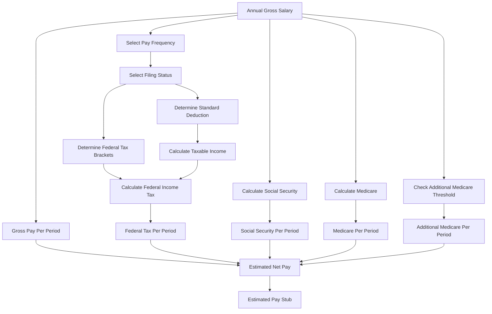

# 💰 US Paycheck & Withholding Estimator

<div align="center">


  <p align="center">
    <strong>A browser-based paycheck estimator that calculates estimated federal withholding, Social Security, Medicare, and take-home pay using 2026 U.S. federal tax figures.</strong>
  </p>

  <h4>
    <a href="#-project-overview">Overview</a> |
    <a href="#-key-features">Features</a> |
    <a href="#%EF%B8%8F-calculation-architecture">Architecture</a> |
    <a href="#-tax-calculation-logic">Tax Logic</a> |
    <a href="#-installation--setup">Setup</a> |
    <a href="#-usage-guide">Usage</a>
  </h4>

</div>

---

## 🔍 Project Overview

Understanding how much of a salary actually reaches your bank account can be difficult because gross salary is reduced by several payroll deductions.

**US Paycheck & Withholding Estimator** is a lightweight, client-side web application designed to provide a quick estimate of paycheck deductions and net pay.

Users enter their **annual gross salary**, select their **pay frequency**, and choose a **federal filing status**. The application then calculates an estimated paycheck breakdown including:

* Federal income tax withholding
* Social Security
* Medicare
* Additional Medicare Tax, when applicable
* Estimated net pay

The estimator uses **2026 federal income tax brackets and standard deductions** and presents the results in a clean, pay-stub-inspired interface.

> ⚠️ This application provides estimates for informational purposes only and is not tax advice.

---

## ⚠️ Problem Statement & Objectives

### The Problem

Employees often know their annual salary but may not know how much they will actually receive in each paycheck.

Common challenges include:

* **Gross vs. Net Pay Confusion**: Annual salary does not represent actual take-home income.
* **Multiple Pay Frequencies**: Weekly, biweekly, semi-monthly, and monthly salaries produce different paycheck amounts.
* **Federal Tax Complexity**: Federal income tax uses progressive marginal tax brackets.
* **Payroll Deductions**: Social Security and Medicare reduce taxable take-home pay.
* **Additional Medicare Tax**: Higher-income earners may be subject to an additional Medicare deduction.

### Objectives

1. **Estimate Periodic Gross Pay** based on annual salary and selected pay frequency.
2. **Calculate Federal Income Tax** using 2026 marginal tax brackets.
3. **Calculate Social Security Contributions** using the applicable wage base.
4. **Calculate Medicare Contributions** using the standard Medicare rate.
5. **Apply Additional Medicare Tax** when income exceeds the filing-status threshold.
6. **Calculate Estimated Net Pay** after the supported deductions.
7. **Provide Transparent Calculations** through an expandable calculation breakdown.
8. **Deliver a Responsive Interface** that works across desktop and mobile screen sizes.

---

## 🌟 Key Features

| Feature                 | Icon | Description                                                              |
| :---------------------- | :--: | :----------------------------------------------------------------------- |
| **Salary Input**        |  💵  | Enter annual gross salary in USD.                                        |
| **Pay Frequency**       |  📅  | Supports weekly, biweekly, semi-monthly, and monthly payroll schedules.  |
| **Filing Status**       |  👤  | Supports Single and Married Filing Jointly (MFJ).                        |
| **Federal Withholding** |  🏛️ | Estimates federal income tax using 2026 marginal tax brackets.           |
| **Social Security**     |  🛡️ | Calculates the 6.2% Social Security payroll tax up to the wage base.     |
| **Medicare**            |  🏥  | Calculates standard Medicare withholding at 1.45%.                       |
| **Additional Medicare** |   ➕  | Applies the 0.9% Additional Medicare Tax above the applicable threshold. |
| **Net Pay Calculator**  |  💰  | Calculates estimated take-home pay after supported deductions.           |
| **Tax Breakdown**       |  📊  | Displays the federal tax brackets used in the calculation.               |
| **Responsive UI**       |  📱  | Adapts the two-column layout for smaller screens.                        |
| **Live Calculation**    |   ⚡  | Results update automatically whenever an input changes.                  |

---

## ⚙️ Calculation Architecture

The application follows a simple client-side calculation pipeline.



---

## 🧮 Tax Calculation Logic

### 1. Taxable Income

The application first subtracts the applicable standard deduction from annual gross salary:

```text
Taxable Income = Annual Gross Salary − Standard Deduction
```

The result cannot fall below zero.

### 2. Federal Income Tax

Federal income tax is calculated progressively across the applicable marginal tax brackets.

For each bracket:

```text
Tax for Bracket =
(Min(Taxable Income, Upper Limit) − Lower Limit) × Tax Rate
```

The taxes from each applicable bracket are then added together.

The application uses separate configurations for:

* **Single**
* **Married Filing Jointly (MFJ)**

The 2026 configuration includes the applicable standard deductions and seven marginal federal tax brackets.

### 3. Social Security

Social Security is calculated at:

```text
Social Security = Min(Annual Salary, $184,500) × 6.2%
```

The application therefore limits Social Security taxable wages to the **$184,500 wage base**.

### 4. Medicare

Standard Medicare withholding is calculated as:

```text
Medicare = Annual Salary × 1.45%
```

### 5. Additional Medicare Tax

The application checks the filing-status-specific threshold.

For Single filers:

```text
Threshold = $200,000
```

For Married Filing Jointly:

```text
Threshold = $250,000
```

Additional Medicare Tax:

```text
Additional Medicare =
Max(0, Salary − Threshold) × 0.9%
```

### 6. Paycheck Calculation

Annual values are divided according to the selected payroll frequency.

Supported frequencies:

| Frequency    | Pay Periods / Year |
| :----------- | -----------------: |
| Weekly       |                 52 |
| Biweekly     |                 26 |
| Semi-monthly |                 24 |
| Monthly      |                 12 |

The application then calculates:

```text
Gross Pay Per Period = Annual Salary ÷ Pay Periods
```

Finally:

```text
Estimated Net Pay =
Gross Pay
− Federal Income Tax
− Social Security
− Medicare
− Additional Medicare
```

---

## 📊 2026 Federal Tax Configuration

### Single

| Taxable Income Range | Rate |
| :------------------- | ---: |
| $0 – $12,400         |  10% |
| $12,400 – $50,400    |  12% |
| $50,400 – $105,700   |  22% |
| $105,700 – $201,775  |  24% |
| $201,775 – $256,225  |  32% |
| $256,225 – $640,600  |  35% |
| $640,600+            |  37% |

**2026 Standard Deduction: $16,100**

### Married Filing Jointly

| Taxable Income Range | Rate |
| :------------------- | ---: |
| $0 – $24,800         |  10% |
| $24,800 – $100,800   |  12% |
| $100,800 – $211,400  |  22% |
| $211,400 – $403,550  |  24% |
| $403,550 – $512,450  |  32% |
| $512,450 – $768,700  |  35% |
| $768,700+            |  37% |

**2026 Standard Deduction: $32,200**

---

## 🧑‍💻 Technology Stack

### Frontend

* **HTML5** — Application structure
* **CSS3** — Responsive styling and layout
* **Vanilla JavaScript** — Calculation engine and dynamic UI updates

### Design

The interface uses a minimal financial-document aesthetic with:

* Serif typography
* Pay-stub-inspired layout
* Responsive two-column design
* Structured deduction rows
* Monospaced numerical values
* Expandable calculation explanation
* Mobile-responsive behavior

---

## 📂 Repository Structure

```text
📁 US-Paycheck-Withholding-Estimator/
│
├── 📄 US_Paycheck_Withholding_Estimator.html
└── 📄 README.md
```

The application is intentionally lightweight and can run directly in a modern web browser without a backend server or external database.

---

## 🚀 Installation & Setup

No Python environment, package manager, or backend server is required.

### 1. Clone the Repository

```bash
git clone https://github.com/YOUR_USERNAME/US-Paycheck-Withholding-Estimator.git
cd US-Paycheck-Withholding-Estimator
```

### 2. Open the Application

Simply open:

```text
US_Paycheck_Withholding_Estimator.html
```

in a modern browser.

### 3. Optional: Run With a Local Server

You can also use a simple local development server:

```bash
python -m http.server 8000
```

Then open:

```text
http://localhost:8000
```

---

## 💻 Usage Guide

### Step 1 — Enter Salary

Enter your annual gross salary in USD.

Example:

```text
$65,000
```

### Step 2 — Select Pay Frequency

Choose from:

* Weekly
* Biweekly
* Semi-monthly
* Monthly

### Step 3 — Select Filing Status

Choose:

* Single
* Married Filing Jointly

### Step 4 — View Estimated Pay Stub

The application immediately displays:

```text
Gross Pay
    ↓
Federal Income Tax
    ↓
Social Security
    ↓
Medicare
    ↓
Additional Medicare (if applicable)
    ↓
Estimated Net Pay
```

### Step 5 — Review the Calculation

Expand **"How this was calculated"** to view the tax methodology and applicable tax brackets.

---

## 🎨 Interface

The application is designed around a simplified digital pay stub.

```text
+-------------------------------------------------------------+
|              US Paycheck & Withholding Estimator            |
| Enter a gross salary to see an estimated paycheck...       |
+----------------------+--------------------------------------+
| Annual Salary        |       Estimated Pay Stub             |
|                      |                                      |
| $65,000              | Gross Pay              $2,500.00   |
|                      |                                      |
| Pay Frequency        | Deductions                           |
| Biweekly             | Federal Tax            -$xxx.xx     |
|                      | Social Security        -$xxx.xx     |
| Filing Status        | Medicare               -$xx.xx      |
| Single               |                                      |
|                      | Estimated Net Pay      $x,xxx.xx    |
+----------------------+--------------------------------------+
```

The original application implements a responsive layout that switches from two columns to a single-column layout on smaller screens.

---

## 🔬 Technical Implementation

The application is entirely client-side.

The main calculation flow is implemented through JavaScript functions:

```text
User Input
    ↓
render()
    ↓
Determine Filing Status
    ↓
Load Tax Configuration
    ↓
Calculate Taxable Income
    ↓
Calculate Federal Tax
    ↓
Calculate Payroll Taxes
    ↓
Calculate Periodic Values
    ↓
Update Pay Stub
```

The core application uses separate constants for the Social Security wage base and payroll tax rates, making the calculation logic easy to update for future tax years.

---

## ⚠️ Limitations

This estimator intentionally provides a simplified estimate.

It does **not** currently account for:

* State income tax
* Local income tax
* W-4 Step 2 adjustments
* Multiple jobs
* Dependents
* Other income
* Additional deductions
* Pre-tax benefits
* Retirement contributions
* Health insurance deductions
* Other employer-specific payroll deductions

The application's own calculation explanation states that the model is simplified to the standard deduction and does not include W-4 adjustments, pre-tax benefits, or state/local taxes.

---

## 🚀 Future Improvements

Potential future enhancements include:

* **State Tax Calculator** — Add state-specific income tax calculations.
* **Local Tax Support** — Include applicable city and local taxes.
* **401(k) Contributions** — Support traditional and Roth retirement contributions.
* **Health Insurance** — Include pre-tax healthcare deductions.
* **W-4 Configuration** — Add support for W-4 Steps 2–4.
* **Paycheck History** — Allow users to save multiple salary scenarios.
* **Tax-Year Selector** — Support multiple federal tax years.
* **Comparison Mode** — Compare different salaries and filing statuses.
* **Interactive Charts** — Visualize gross pay versus deductions.
* **PDF Pay Stub Export** — Generate a printable estimated pay stub.
* **Dark Mode** — Add an alternative visual theme.
* **Currency & Localization** — Improve internationalization for future extensions.

---

## 🤝 Contribution Guidelines

Contributions and improvements are welcome!

### Contribution Workflow

1. Fork the repository.
2. Create a feature branch:

```bash
git checkout -b feature/AmazingFeature
```

3. Make your changes.
4. Commit your changes:

```bash
git commit -m "Add AmazingFeature"
```

5. Push the branch:

```bash
git push origin feature/AmazingFeature
```

6. Open a Pull Request.

---

## 📄 License

This project can be distributed under the **MIT License**.

See the `LICENSE` file for details.

---

## ✍️ Author & Contact

**Developer:** Toms Thankachan

**GitHub:** Add your GitHub profile link here

**LinkedIn:** Add your LinkedIn profile link here

**Portfolio:** Add your portfolio website here

**Email:** Add your email address here

---

<div align="center">

### 💰 Built to make paycheck calculations easier to understand.

**US Paycheck & Withholding Estimator**

*Estimate only — not tax advice.*

</div>
